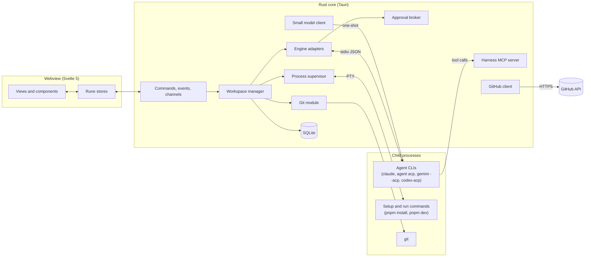

# Architecture

How Harness is built. Product context lives in [`PRODUCT.md`](PRODUCT.md) and feature behaviour in [`features/`](features/README.md). This document says which part of the stack owns each piece of behaviour, and records the technical decisions that the feature specs depend on.

## Stack

| Layer | Choice | Role |
| --- | --- | --- |
| Native shell and backend | **Tauri 2.x (Rust)** | Desktop window, OS integration, and every side effect: git, processes, agents, GitHub, storage. |
| UI framework | **Svelte 5 + Vite** | Single page app rendered in the system webview. Runes (`$state`, `$derived`, `$effect`) drive fine-grained updates for streaming conversations, logs and diffs without a virtual DOM. |
| Components and styling | **Tailwind CSS v4 + bits-ui / shadcn-svelte** | Dark developer UI on accessible primitives: dialogs, command palette, popovers, menus, tabs, switches, resizable panes. |
| Icons | **lucide-svelte** | Status, git action and workspace state icons. |

The rest of this document adds libraries *inside* these layers. None of them change the stack.

### The one correction: PTYs are for apps, not agents

The stack brief says agent CLIs run "via PTY streams". A pseudo-terminal gives Harness the same bytes a human would see in a terminal: a redrawing TUI full of ANSI escape codes. Every core feature of the conversation (tool-call steps, edit rows, plans, approval cards, findings) needs **structured events**, and scraping a TUI to get them would break on every CLI release.

So the backend runs two kinds of child process:

| Kind | Transport | Used for |
| --- | --- | --- |
| **Agent engines** | stdio pipes speaking a JSON protocol (ACP, or Claude Code's stream-JSON) | Every thread. See [Engine adapters](#engine-adapters). |
| **Shell processes** | PTY | Worktree setup commands and the app's run command, so tools print colour and behave as they do in a terminal. See [Process supervisor](#process-supervisor). |

## Feature coverage

Each feature spec checked against the stack. "Supported" means the stack handles it with the libraries named here. "Needs a decision" means the stack can do it but the product hasn't said what it should do.

| # | Feature | Verdict | How |
| --- | --- | --- | --- |
| 01 | App shell and sidebar | Supported | Tauri overlay title bar with native macOS traffic lights; `sysinfo` crate for the memory meter; dock badge for pending approvals. |
| 02 | Command palette and shortcuts | Supported | bits-ui `Command` with its built-in filter off, so Harness applies the spec's substring match on label and meta. Shortcuts are handled in the webview and mirrored in the native app menu. |
| 03 | Toasts | Supported | shadcn-svelte `Sonner` (svelte-sonner) inside a polite live region. OS notifications, a gap in the spec, come from `tauri-plugin-notification`. |
| 04 | Homebase and cards | Supported, needs a decision | Summaries need a small model call, which the stack doesn't name. See [Small model calls](#small-model-calls). |
| 05 | Open pull requests | Supported, needs a decision | GitHub client in Rust; token in the macOS Keychain. Auth method is open. See [GitHub](#github). |
| 06 | New workspace | Supported | `git worktree add` from the Rust git module; branch lists from `git for-each-ref`; name and branch drafting stay local in the UI. |
| 07 | Worktree provisioning | Supported | Setup commands run in a PTY in the user's login shell environment, stop on first failure. |
| 08 | Teardown | Supported | Stop agents and the app by process group, then `git worktree remove` and `git branch -D`. |
| 09 | Workspace header | Supported | "Open in editor" and "Reveal in Finder" (spec gaps) via `tauri-plugin-opener`. |
| 10 | Thread tabs | Supported | One engine process per thread, all with the worktree as their working directory. |
| 11 | Agent conversation | Supported via structured protocol | ACP events map onto the timeline item kinds. Long threads need a virtual list; agent markdown needs sanitising. |
| 12 | Composer | Supported, needs a decision | Sending is `session/prompt`. **Pause can't be a true pause**; see [Pause semantics](#pause-semantics). |
| 13 | Approvals | Supported | ACP `session/request_permission` and Claude Code's `can_use_tool` control request both block the agent until Harness answers. Auto-approve read-only tools is enforced by the backend. |
| 14 | Changes panel | Supported | Filesystem watcher plus `git diff`; custom diff renderer with Shiki highlighting and jsdiff word ranges; `Resizable` panes. |
| 15 | Run app and Output | Supported | PTY per app in its own process group; ANSI to styled spans; port read from output; exit code gives the missing Crashed state. |
| 16 | Branch switching | Supported | `git switch`, refused with a clear message when the worktree is dirty. |
| 17 | Pull and rebase | Supported | Shared `git fetch` per repo; conflicts detected from exit status and unmerged paths. |
| 18 | Create PR | Supported | `git push` with the user's own credentials, then the GitHub API. Drafting uses the small model call. |
| 19 | Review workspaces | Supported | `git fetch origin pull/<N>/head`, worktree on that ref, Reviewer thread. |
| 20 | Review findings | Supported | Findings arrive as structured tool calls to Harness's own MCP server, not parsed from prose. Submit review uses the GitHub reviews API. |
| 21 | Settings | Supported | Persisted in SQLite; engine detection by resolving each CLI on the login-shell `PATH`. |
| 22 | Repos | Supported | Native folder picker (`tauri-plugin-dialog`); `git rev-parse` validation; default branch from `origin/HEAD`. |

Nothing in the specs needs a different stack. Former open decisions are recorded in [Decisions (MVP)](#decisions-mvp).

## System overview



**The Rust core is the source of truth.** The webview holds a mirror of state for rendering. It never spawns processes, reads files, or holds tokens. If the webview reloads, it asks the core for a snapshot and carries on.

## Rust core

Modules under `src-tauri/src/`. Each owns one concern and exposes async functions to the IPC layer.

### Shell environment (`shell_env`)

macOS GUI apps don't inherit the user's shell `PATH`, so `claude`, `pnpm`, `nvm` and `uv` won't be found from a plain spawn. At launch, the core runs the user's login shell once (`$SHELL -l -i -c 'env -0'`), caches the result, and uses it for every child process. A **Reload environment** action re-reads it. This single step is what makes provisioning, Run and engine detection work.

### Repos and git (`git`)

Harness shells out to the system `git` rather than using a library (`git2`, `gix`). That way it inherits the user's config, credential helpers, SSH keys, hooks and LFS, and a push from Harness behaves like a push from the terminal. Output is read from porcelain and `-z` formats.

| Need | Command |
| --- | --- |
| Validate a repo | `git -C <path> rev-parse --show-toplevel` |
| Default branch | `git symbolic-ref refs/remotes/origin/HEAD`, falling back to `main` |
| Branches | `git for-each-ref refs/heads refs/remotes` |
| Create worktree | `git worktree add -b <branch> <path> <base>` |
| Review checkout | `git fetch origin pull/<N>/head:<local>` then `git worktree add <path> <local>` |
| Behind count | `git rev-list --count HEAD..origin/<base>` |
| Diff | `git diff --numstat` and `git diff <merge-base>` including uncommitted work, plus untracked files |
| Switch branch | `git switch <branch>` (refused if `git status --porcelain` is not empty) |
| Pull / rebase | `git merge origin/<base>` / `git rebase origin/<base>`; unmerged paths from `git diff --name-only --diff-filter=U` |
| Push | `git push -u origin <branch>` |
| Teardown | `git worktree remove [--force] <path>`, `git branch -D <branch>` |

**Worktree path:** `~/.harness/worktrees/<repo>/<branch-slug>`. Including the repo fixes the collision noted in [08](features/08-teardown.md).

**Fetching:** worktrees share one object store, so the core runs one background `git fetch` per repo (every 5 minutes and on window focus), then recomputes "behind" for every workspace on that repo.

**Live diffs:** a `notify` watcher on each worktree, debounced to about 300ms and filtered through `.gitignore` (the `ignore` crate), triggers a diff refresh. The core sends the file list and per-file hunks; the UI never runs git.

All git calls for one worktree go through a per-worktree queue so two operations can't race on the index.

### Workspace manager (`workspace`)

Owns each workspace's lifecycle as a state machine and enforces the locks the specs describe:

```
creating → provisioning → ready ⇄ (threads running / idle / waiting) → tearing_down → gone
                 ↓
         provisioning_failed (retry, skip and continue, edit setup)
```

- **Branch switch lock:** refused while any thread is running or provisioning (checked again at execution time, as in [16](features/16-branch-switching.md)).
- **Provisioning:** worktree, then setup commands in order, then the Lead thread's engine. Stops on the first non-zero exit.
- **Teardown order:** stop agents (graceful, then forced after 5s), stop the app process group, remove the worktree, delete the branch if chosen. On any failure the workspace stays and the error is shown.
- **Environment for setup and run:** `HARNESS_REPO_PATH` (the main checkout), `HARNESS_WORKTREE_PATH`, `HARNESS_WORKSPACE`, `HARNESS_BRANCH`, `HARNESS_BASE`. This replaces hard-coded paths like `cp ~/code/my-app/.env.local`.

### Engine adapters (`engines`)

The core of the product. Each thread is one long-lived engine process with the worktree as its working directory. Adapters translate each engine's native stream into one internal event model, based on the **Agent Client Protocol (ACP)** types from the `agent-client-protocol` crate.

| Engine | Process | Protocol | Approvals arrive as |
| --- | --- | --- | --- |
| Cursor CLI | `agent acp` | ACP over stdio | `session/request_permission` |
| Gemini CLI | `gemini --acp` | ACP over stdio | `session/request_permission` |
| Codex CLI | `codex-acp` (wraps `codex app-server`) | ACP over stdio | `session/request_permission` |
| Claude Code | `claude -p --input-format stream-json --output-format stream-json --verbose --permission-prompt-tool stdio --await-initialize` | Claude stream-JSON, translated to ACP events in Rust | `control_request` with subtype `can_use_tool` |

Claude Code gets a native Rust translator because its ACP adapter is a Node package, which would mean bundling or requiring Node. Its control protocol is the one Anthropic's Agent SDK uses, but it's thinly documented and has had permission bugs, so it's the first thing to spike (see [Spikes](#spikes-before-building-features)).

**Mapping to timeline items** ([11](features/11-agent-conversation.md)):

| Engine event | Timeline item |
| --- | --- |
| Agent message chunk | `thought` (streamed, rendered as sanitised markdown) |
| Tool call, kind `read` / `search` / `execute` / `fetch` | `tool` step, grouped into a run |
| Tool call, kind `edit` / `delete` with a diff | `edit` step linked to the Changes panel |
| Plan update | `plan` |
| Permission request | `approval` |
| Harness MCP `report_finding` call | finding, plus a `findings` card when the review ends |
| Current tool call in progress | the live row's subtitle, replacing the prototype's rotating strings |
| Usage update | token and cost counters (a spec gap) |

**Sessions and restarts:** each thread stores its engine session id. After Harness restarts, the thread resumes with ACP `session/load` or `claude --resume <id>` where the engine supports it; otherwise the transcript is kept read-only and the next message starts a new session with a summary of the old one.

**Engine detection** (Settings, [21](features/21-settings.md)): resolve each binary on the login-shell `PATH`, run `--version`, and check sign-in status. Missing engines are shown as not installed rather than failing at workspace creation.

### Approval broker (`approvals`)

Holds every pending permission request as a oneshot channel keyed by approval id. The engine adapter blocks on it; the UI resolves it with `approve` or `deny`.

- **Auto-approve read-only tools:** the broker answers requests for read and search tools itself when the setting is on, and records a `Read-only, auto-approved` chip. Edits, deletes and commands always reach the user.
- **Timeouts:** Claude Code times out waiting after about a minute. The adapter keeps the request alive (or re-issues it) so an approval can wait while the user is away, which is the whole point of supervision.
- **Cross-thread effects** like "Send to Lead" ([13](features/13-approvals.md)) are Harness actions, not engine permissions: approving posts a message into the target thread.
- Pending counts feed the tab badges, sidebar, Homebase cards, dock badge and OS notifications.

### Harness MCP server (`mcp`)

A small MCP server inside the core (the `rmcp` crate) that every engine is given at session start. It turns things the specs need as structure into tool calls, so Harness never parses prose:

| Tool | Used by | Purpose |
| --- | --- | --- |
| `report_finding` | Reviewer threads | Severity, title, file, line, explanation ([20](features/20-review-findings.md)). Validated before display. |
| `finish_review` | Reviewer threads | Marks the review done and shows the Findings tab. |
| `mark_finding_fixed` | Fixing threads | Ties a fix to a finding id and commit. |
| `read_app_output` | Any thread | Lets the agent see the Output log (an open question in [15](features/15-run-app-and-output.md)). |
| `restart_app` | Any thread | Optional; gated behind an approval. |

### Process supervisor (`process`)

Runs setup and run commands in a PTY (`portable-pty`) using the login-shell environment, each in its own process group so Stop, Restart and Teardown kill the whole tree.

- **Output:** read on a background task, split into lines, kept in a ring buffer (500 lines on screen, full log on disk for the session), and streamed to the UI in batches of about 30ms.
- **Ports:** the port is read from the output (`localhost:<port>`, `127.0.0.1:<port>`), confirmed by checking the process tree's listening sockets. Harness also sets `PORT` to a free port before spawning, which many frameworks respect. This replaces the prototype's prediction.
- **Exit:** a non-zero exit while running becomes the **Crashed** state with the exit code and a Restart button.
- **Input:** the PTY accepts keystrokes, so dev-server shortcuts (`r`, `o`) are possible later without changing the design.
- **Quit:** on app exit, the supervisor stops every app and agent before the process ends.

### GitHub (`github`)

A Rust client (`octocrab` or `reqwest` with GraphQL). The token lives in the macOS Keychain (`keyring` crate) and never reaches the webview.

| Need | API |
| --- | --- |
| Open PRs involving the user | GraphQL search with `is:pr is:open` and `author:@me`, `review-requested:@me`, `assignee:@me`, `mentions:@me` |
| Checks and review state | `statusCheckRollup` and `reviewDecision` in the same query |
| Create PR | `POST /repos/{owner}/{repo}/pulls` after `git push` |
| Submit review | `POST /repos/{owner}/{repo}/pulls/{n}/reviews` with a verdict and line comments (`path`, `line`, `side`); findings outside the diff go in the review body |

Sync runs every 2 minutes, on window focus and on demand, respecting rate-limit headers. PRs are matched to registered repos by their `origin` remote URL, which fixes "which repo does this PR belong to" in [05](features/05-open-pull-requests.md).

### Small model calls (`llm`)

Workspace summaries ([04](features/04-homebase-workspace-cards.md)), the PR "why" ([18](features/18-create-pr.md)) and optional name refinement ([06](features/06-new-workspace.md)) need a fast, cheap model. Two ways to reach one:

1. **Through an installed engine** (default): a one-shot `claude -p --model haiku --output-format json` with the thread excerpt and diff stats. Uses the sign-in the user already has; costs about a second of CLI start-up.
2. **Direct API key**: an Anthropic key stored in the Keychain, called over HTTPS from Rust. Faster, but asks the user for a key.

Summaries refresh on significant events (edit batches, approvals, turn end), debounced to at most one call per workspace per minute.

### Storage (`store`)

SQLite (`rusqlite`, bundled) in the app data directory. Settings, repos and repo config, workspaces, threads, the full timeline of each thread as an append-only event log, approvals, findings, and a PR cache. Keeping transcripts here means a workspace's history can outlive its worktree, which answers the "transcripts are lost on teardown" gap in [08](features/08-teardown.md) if the product wants an archive.

Repo config can also be read from a committed file (`.cormux/config.json`) so a team shares setup and run commands, with Settings as a local override.

### Metrics (`metrics`)

`sysinfo` sums resident memory for the Harness process, its webview process, and each engine and app process tree, sampled every 4 seconds. The meter shows the total and can break it down per workspace.

## IPC

| Mechanism | Direction | Used for |
| --- | --- | --- |
| **Commands** (`#[tauri::command]`) | UI → core | Every action: create workspace, send message, approve, run app, create PR. Typed request and response. |
| **Channels** (`tauri::ipc::Channel`) | core → UI | High-volume ordered streams: agent message chunks, PTY output, diff updates. One per subscribed thread or log. |
| **Events** | core → UI | Low-volume state changes: workspace status, approval counts, PR sync, toasts. |

TypeScript types for commands and payloads are generated from the Rust definitions (`tauri-specta`) so the two sides can't drift. Every state event carries a version number; if the UI sees a gap, it re-fetches a snapshot.

The webview only subscribes to streams it's showing. A background thread keeps its state in the core; switching to it loads recent items and then subscribes.

## Frontend

### Layout

```
src/
  lib/
    ipc/          generated bindings, channel helpers
    state/        rune stores (*.svelte.ts): app, workspaces, threads, prs, settings
    components/
      ui/         shadcn-svelte components (generated, owned by the repo)
      shell/      sidebar, title bar, palette
      homebase/   workspace cards, PR list
      workspace/  header, tabs, conversation, composer, approvals, changes, output, findings
      settings/
  routes/         view switch: homebase, workspace, settings (no router needed)
```

State lives in class-based rune stores (`$state` fields, `$derived` getters) hydrated from a core snapshot and patched by events. Derived values, like a card's "Needs Attention" badge or the sidebar's "N working", are `$derived` from thread state so they never go stale. Thread timelines are append-mostly arrays; fine-grained reactivity means a streaming chunk updates one text node, not the conversation.

### Components mapped to shadcn-svelte and bits-ui

| Spec element | Component |
| --- | --- |
| Command palette | `Command` inside `Dialog` |
| New workspace, Create PR, Teardown confirm | `Dialog`, `AlertDialog` |
| Base branch typeahead | `Combobox` pattern (`Popover` + `Command`) |
| ⋯ menu, branch picker | `DropdownMenu` (with `RadioGroup` items for branches) |
| Row overflow menus (spec gap) | `ContextMenu` |
| Thread, Findings and Output tabs | `Tabs` (roving focus and arrow keys built in) |
| Settings switches, default engine | `Switch`, `RadioGroup` |
| Findings checkboxes | `Checkbox` (supports indeterminate) |
| Conversation and Changes split | `Resizable` (paneforge) |
| Filters (All / Running / Idle) | `ToggleGroup` |
| Tooltips on locked controls | `Tooltip` |
| Toasts | `Sonner` |

### Specialised rendering

- **Diffs** ([14](features/14-changes-panel.md)): a custom Svelte renderer over hunks from the core. Syntax highlighting with **Shiki** (JavaScript regex engine, grammars loaded on demand); word-level ranges from **jsdiff**. Unified and split layouts share one data model. CodeMirror's merge view is the upgrade path if an in-app editor arrives.
- **Conversation**: agent text rendered as markdown (`marked`), sanitised with **DOMPurify** before insertion. Threads longer than a few hundred items use a virtual list (`@tanstack/svelte-virtual`), or older tool runs collapse.
- **Output log**: ANSI colour codes converted to styled spans (`anser`). The log is 500 lines, so no virtualisation. If full terminal emulation is ever needed, `xterm.js` drops into the same panel.

### Window and platform

- Overlay title bar with hidden title and native traffic lights; the sidebar's top strip is a `data-tauri-drag-region`. The prototype's decorative window controls are replaced by the real ones.
- Minimum window size of about 960 × 600. The prototype's stacked layout below 760px isn't needed on desktop.
- A native app menu mirrors the shortcuts (`⌘K`, `⌘N`, `⌘,` for Settings) so they're discoverable. `⌘N` doesn't conflict with anything in a Tauri window.
- `prefers-reduced-motion` works in WKWebView; the in-app switch adds a `reduce-motion` class as specified.

## Security

Agent output is untrusted and the webview can call backend commands, so an injected script would be dangerous.

- **Strict CSP**; no remote scripts or content. Links from agent text open in the default browser via the opener plugin, never in the webview.
- **No generic shell access from the UI.** The Tauri shell plugin isn't exposed. The core only runs commands it builds itself: git, configured setup and run commands, and engine binaries.
- **Capabilities** grant the webview only Harness's own commands and the dialog, opener and notification plugins.
- **All agent text is sanitised** before rendering; `{@html}` is only used on sanitised output.
- **Secrets** (GitHub token, optional model key) stay in the Keychain and in Rust.

## Performance budget

| Measure | Target | Note |
| --- | --- | --- |
| App bundle | about 10 MB | Rust binary plus frontend assets. Shiki grammars add a few MB if bundled rather than lazy-loaded. |
| Rust core, idle | 15 to 30 MB | The stack's figure. |
| Webview process, idle | about 50 to 120 MB | WKWebView runs in its own process and isn't included in the figure above. |
| Per agent thread | 150 to 400 MB | The engine CLI's own footprint, outside Harness's control. This dominates the memory meter. |
| Streaming | 60 fps while an agent streams and an app logs | Batching on channels and fine-grained updates. |

The stack's 15 to 30 MB claim holds for the core, but the number users see in Activity Monitor will be larger because of the webview and, above all, the agents. The memory meter should say so honestly.

## Platforms

macOS first. Tauri, `portable-pty` (ConPTY on Windows) and the git approach all work on Windows and Linux, but three things need work there: login-shell environment resolution, process-group termination (job objects on Windows), and WebKitGTK's weaker CSS support on Linux.

## Decisions (MVP)

Closed under epic COR-31. Product-facing summary in [`PRODUCT.md` → Decisions (MVP)](PRODUCT.md#decisions-mvp).

| ID | Shipped behaviour |
| --- | --- |
| COR-207 | **Engines:** Adapters for Claude (stream-JSON), Cursor/Codex/Gemini (ACP). Settings `detectEngines` shows all four; default engine is Claude. MVP launch story is Claude + Cursor; Codex/Gemini when installed. |
| COR-208 | **GitHub auth:** Keychain service `cormux` / user `github-token`; `resolve_token` falls back to `gh auth token`. **Reviews:** `ReviewLineComment` on submit when findings include path and line. |
| COR-209 | **Small model:** `LlmClient::complete` uses Keychain Anthropic key if present, else `claude -p --model haiku --output-format json`. Debounced per workspace (~60s). |
| COR-210 | **Quit:** `RunEvent::ExitRequested` → `process.stop_all()` (PTY apps). **Teardown:** `engines.stop_threads` sends `EngineCommand::Shutdown` then waits `STOP_GRACE` (5s) per thread. |
| COR-211 | **Archive:** Teardown sets `workspaces.archived_at` and clears `worktree_path`; timeline events stay in SQLite. Active queries filter `archived_at IS NULL`. |
| COR-212 | **Changes review:** `review_worktree_file`: `approve` → `git stage`; `reject` → `discard_worktree_file`. UI `undo` only resets `changesReview` state. |
| COR-213 | **Approvals:** Broker auto-answers read/search when `autoApproveReadOnly` is on; edit/delete/execute always surface. Allowlist hooks reserved (`approvals/hooks.ts`) for COR-143. |
| COR-214 | **Skills:** `SkillsSettings` empty state only; no persistence or session injection. |
| COR-215 | **No in-app editor/tree.** Conflicts: `abort_workspace_git_conflict`. Workspace header opens worktree in OS editor/Finder via opener plugin. |
| COR-216 | **UI stack:** `components.json` style `nova`; `@fontsource-variable/geist` fonts; Tailwind v4 + shadcn-svelte. |
| COR-217 | **Join thread:** `join_thread_provisioning` attaches to existing worktree; no nested worktrees per thread. |
| COR-218 | **License:** `Cargo.toml` `license = "UNLICENSED"`; no payment or entitlement checks in app. |

### Pause semantics

The composer's Pause ([12](features/12-composer.md)) can't freeze an agent mid-thought. Suspending the process (`SIGSTOP`) would leave its model request hanging until the API times out. The realistic behaviour is **interrupt and hold**: Pause cancels the current turn (ACP `session/cancel`, or Claude Code's interrupt), the thread shows "Paused by you", messages typed while paused are queued, and Resume sends the queue (or "continue") as the next turn. An in-flight tool call is either allowed to finish or cancelled with it, depending on the engine.

## Spikes before building features

Short experiments that de-risk the plan, in order:

1. **Claude Code control protocol:** spawn `claude -p` with stream-JSON in and out, `--permission-prompt-tool stdio`, and `--await-initialize`. Send a host `initialize` control request before the first user message, then two messages, receive and answer a `can_use_tool` request, interrupt a turn, resume a session. `-p` is required: the CLI only accepts `--input-format stream-json` in print mode. Without the initialize handshake, permission asks are auto-denied (`system`/`permission_denied`) instead of `can_use_tool`. Interrupt is a host `control_request` with `subtype: interrupt`. Resume is a new process with `--resume <session_id>` from `system`/`init`.
2. **Cursor over ACP:** `agent acp` with the Rust `agent-client-protocol` client. Initialize, `session/new`, answer `session/request_permission`, then `session/load`. Mocked in tests; live binary is `--ignored`.
3. **Login-shell environment:** resolve env via `$SHELL -l -i -c 'env -0'` (the same capture a signed Finder-launched `.app` needs), then run `claude --version` / `pnpm` in that env. Finder codesign is the same function with a GUI-empty `PATH`.
4. **PTY app lifecycle:** `portable-pty`, port parsed from `localhost:<port>` / `127.0.0.1:<port>`, Stop uses `killpg`, non-zero exit is the crash code.
5. **Streaming load:** Homebase → "Streaming load spike" streams agent text and 100 Hz logs over IPC while a 5000-line diff is open; fps is shown in the workspace header.
